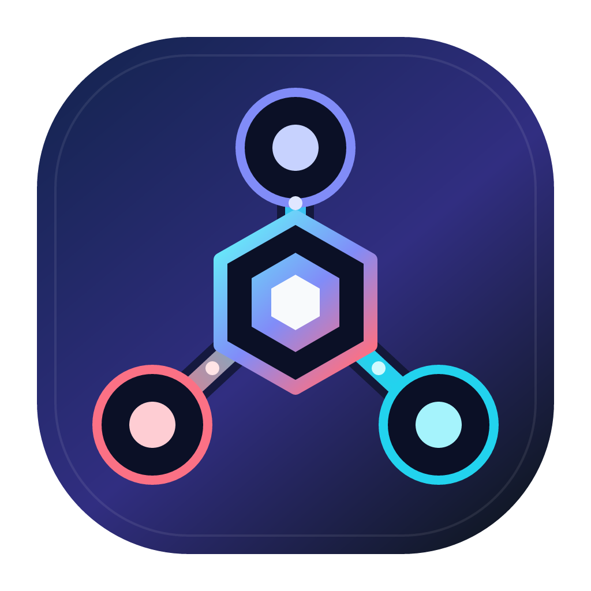

<div align="center">



# New API Distributed

**基于 [QuantumNous/New API](https://github.com/QuantumNous/new-api) 的 master/edge 分布式扩展**

[原版项目说明](./README.origin.md) · [分布式架构](./docs/distributed-architecture.md) · [配置参考](./docs/distributed-configuration.md) · [生产切换 SOP](./docs/original-newapi-to-distributed-master-sop.md)

</div>

## 项目定位

New API Distributed 在同一个 Go module 中为 New API 增加 master/edge 分布式运行能力，同时保留上游兼容的默认 master 入口。

- **master** 继续提供 New API 的用户、令牌、渠道、计费、日志和管理后台能力，并承担 edge 控制面、策略快照、余额复制与结算汇总。
- **edge** 在节点本地完成用户请求鉴权、模型策略检查、额度预留、上游调用和账务落盘；普通请求不依赖同步访问 master。
- **CPA** 作为 edge 的本地上游执行引擎，只接收已经通过 edge 鉴权和计费边界的内部请求，不作为公开旁路。

原版 New API 的完整功能、模型支持、部署方式、社区信息和上游署名保留在 [README.origin.md](./README.origin.md)。

## 核心能力

- 保留上游兼容的 master 构建入口，关闭分布式开关时不注册 edge 控制面。
- 使用 master 签名的最小策略快照，把用户、令牌、模型、分组、渠道和计费策略同步到 edge。
- 使用 edge 本地签名令牌快照完成请求鉴权，正常请求路径不对 master 发起同步调用。
- master 与 edge 从共享路由注册表暴露同一套用户侧 AI 数据面，包括 Responses 压缩、多模态、Realtime 和异步任务；edge 不回源 master。
- 使用余额复制、本地 reservation、结算区块和幂等事件维护用户钱包、订阅与 token 额度一致性。
- 使用本地 SQLite 保存 edge 快照、余额投影、预留、任务、outbox 和结算状态，节点重启后继续恢复。
- 使用节点凭证、请求签名、nonce、幂等键和节点代次保护控制面请求。
- 使用消费日志 outbox 和全局账务事件键防止重复投影消费日志。
- 支持节点心跳、公开地址声明、快照轮换、租约续期、优雅 drain 和 fail-closed。
- master 与 edge 复用现有 relay、协议适配、鉴权上下文、计费表达式和额度换算实现，不维护平行副本。

## 架构

```text
                 Codex / Claude Code / 其他 Agent
                              │
                    OpenAI / Claude 等兼容 API
                              │
                   ┌──────────┴──────────┐
                   ▼                     ▼
┌────────────────────────┐    ┌────────────────────────┐
│         master         │◄──►│          edge          │
│                        │    │                        │
│ 用户、令牌、渠道、计费 │    │ 本地鉴权、策略与账务   │
│ PostgreSQL / Redis     │    │ SQLite / 余额投影      │
└────────────────────────┘    └───────────┬────────────┘
             控制面：策略快照 / 余额 / 结算 / 心跳     │
                                             │ 内部上游调用
                                             ▼
                                      ┌──────────────┐
                                      │  本地 CPA 池 │
                                      └──────────────┘
```

master 是全局业务和账务真值。edge 只持有服务请求所需的最小快照与余额投影；master 不可达时，edge 继续使用最后一份已验证策略和本地余额 overlay，直到 token/订阅到期、可用余额触及安全下限、账务恢复未完成或 settlement circuit 打开。

## 运行入口

| 入口 | 构建目标 | 用途 |
|------|----------|------|
| `main.go` | `new-api` | 默认 master；保持上游 New API 兼容入口 |
| `cmd/newapi-edge` | `newapi-edge` | 独立 edge 运行时；加载本地 SQLite、控制面客户端和 CPA 路由 |

主要目录：

```text
cmd/newapi-edge/       edge 二进制入口
internal/app/          master 与 edge 共享的应用启动流程
controller/            master 控制面和节点管理接口
middleware/            edge 鉴权与请求准入边界
model/                 master 全局状态与 edge 本地持久化模型
pkg/edgeauth/          控制请求签名与校验
pkg/edgesettlement/    结算区块摘要和链式校验
pkg/edgesnapshot/      快照摘要、签名和数据集校验
pkg/edgetoken/         token 指纹
service/edge/          控制面、快照、余额复制、结算和节点生命周期
ops/master-switch/     原版/master 演练、切换和回滚脚本
```

## 构建

构建版本要求以 `go.mod`、`Dockerfile` 和 `web/package.json` 为准。前端使用 Bun。

### Docker 构建 master

```bash
docker build -t <master-image> .
```

Dockerfile 会构建 default/classic 两套前端，并生成默认 master 二进制。

### 本地构建 master 与 edge

```bash
cd web
bun install --frozen-lockfile

cd default
bun run build

cd ../classic
bun run build

cd ../..
go build -o new-api .
go build -o newapi-edge ./cmd/newapi-edge
```

运行 master 时，`EDGE_DISTRIBUTED_ENABLED` 默认为 `false`。启用控制面前必须配置独立的快照签名密钥，并完成数据库迁移和生产演练。

edge 必须配置 master 地址、节点身份、节点凭证、公开地址、独立 SQLite 文件和本地 CPA 地址。完整变量及约束见 [分布式配置](./docs/distributed-configuration.md)。

真实域名、IP、端口、账号、密钥、镜像标签和部署路径只保存在私有 `.env`、密钥系统或部署配置中，不写入代码仓库文档。

## 数据与兼容性

- master 继续支持 New API 已有的 SQLite、MySQL 和 PostgreSQL 主数据库。
- edge 使用独立 SQLite，不能复用 master 的 `SQL_DSN` 或日志数据库。
- 首次从原版 New API 切换到 master 时，建议保持分布式控制面关闭，先验证上游兼容入口。
- 原版与 master 共用同一 PostgreSQL 时属于原地 Schema 升级，不是全量或增量数据复制。
- 独立数据库之间没有内置 CDC 或双写追平能力，需要一致性逻辑快照和明确停写窗口。
- edge 产生真实流量后，回滚前必须停止准入并排空节点本地 outbox、在途请求、租约和结算状态。

生产切换使用以下文档和脚本：

- [原版 New API 切换至 newapi-distributed master SOP](./docs/original-newapi-to-distributed-master-sop.md)
- [Master 数据切换与回滚](./docs/distributed-master-switch.md)
- [`ops/master-switch/drill.sh`](./ops/master-switch/drill.sh)
- [`ops/master-switch/cutover.sh`](./ops/master-switch/cutover.sh)

## 验证

```bash
go test ./...
go test -race ./...
go vet ./...
go build ./...
```

前端分别在 `web/default/` 和 `web/classic/` 中执行：

```bash
bun run build
```

涉及数据库、计费、租约或结算的变更必须同时验证 SQLite、MySQL 和 PostgreSQL 兼容性，并保持预扣、结算、退款和日志投影的账务不变量。

## 文档导航

| 文档 | 内容 |
|------|------|
| [原版 README](./README.origin.md) | New API 完整功能、部署、模型支持、社区与上游说明 |
| [设计上下文](./CONTEXT.md) | 分布式开发的当前上下文和阅读入口 |
| [分布式设计上下文](./docs/distributed-design-context.md) | 业务约束、设计目标和已有决策 |
| [分布式架构](./docs/distributed-architecture.md) | master、edge、CPA、快照、租约和结算的稳定架构 |
| [分布式配置](./docs/distributed-configuration.md) | master 与 edge 环境变量、范围和安全约束 |
| [实施计划](./docs/distributed-implementation-plan.md) | 实现顺序和验证门禁 |
| [架构决策记录](./docs/adr/) | 已接受的分布式 ADR |
| [生产切换 SOP](./docs/original-newapi-to-distributed-master-sop.md) | 从原版切换 master、验收与回滚步骤 |

## 上游项目与许可证

本项目基于 **New API** 扩展。New API 由 **QuantumNous** 维护：

- 上游仓库：[github.com/QuantumNous/new-api](https://github.com/QuantumNous/new-api)
- 上游完整 README：[README.origin.md](./README.origin.md)
- 上游官方文档：[docs.newapi.pro](https://docs.newapi.pro/)

本仓库继续保留 New API、QuantumNous 以及其他上游贡献者的品牌、版权、NOTICE 和许可证信息。许可证与第三方声明见 [LICENSE](./LICENSE)、[NOTICE](./NOTICE) 和 [THIRD-PARTY-LICENSES.md](./THIRD-PARTY-LICENSES.md)。
